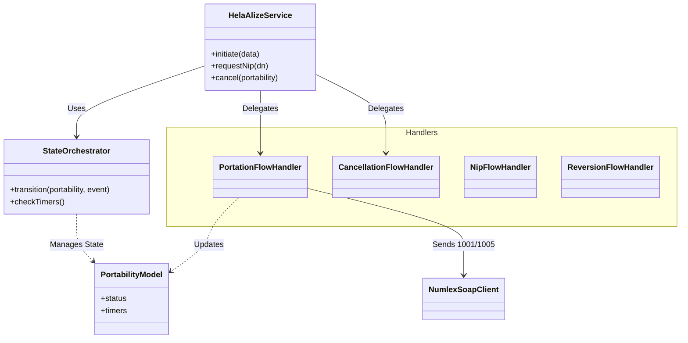

# Architecture Diagrams

## System Context
The HELA Alize package acts as the bridge between the Host Application (Auster) and the Central Database (ABD/NUMLEX).

```mermaid
flowchart TB
    User((End User))
    Admin((Administrator))
    
    subgraph "Host Application (Auster)"
        WebApp[Web Application]
        Scheduler[Laravel Scheduler]
    end

    subgraph "Ometra/Hela-Alize Package"
        Facade[HelaAlize Facade]
        Orchestrator[State Orchestrator]
        Handlers[Flow Handlers]
        SoapClient[NUMLEX SOAP Client]
        SftpClient[SFTP Client]
    end

    subgraph "External Systems"
        NUMLEX_ABD[NUMLEX (ABD) SOAP API]
        NUMLEX_SFTP[NUMLEX SFTP Server]
    end

    User -->|Initiates Portability| WebApp
    Admin -->|Manages Process| WebApp
    
    WebApp -->|Calls| Facade
    Facade -->|Delegates to| Orchestrator
    Orchestrator -->|Uses| Handlers
    Handlers -->|Send Messages| SoapClient
    SoapClient -->|XML/SOAP| NUMLEX_ABD

    NUMLEX_ABD -->|Async Responses (Webhook)| Handlers
    
    Scheduler -->|Triggers| SftpClient
    SftpClient -->|Downloads Files| NUMLEX_SFTP
```

---

## Component Diagram (Internal)


